# Light Monitor 95


A comprehensive light-level monitoring and control system with a retro Windows 95 aesthetic. This system bridges physical hardware (Arduino) with modern robotics middleware (ROS2) and a web-based desktop environment (Flask).

---

## 🏗️ Architecture Overview

The system is designed with a strict separation of concerns, ensuring modularity and robustness.


### Key Components
1.  **Hardware Layer**: Arduino UNO R3 sensing the physical world.
2.  **Communication Layer**: ROS2 (Robot Operating System 2) nodes handling raw data transport.
3.  **Application Layer**: Flask web server hosting a Windows 95 Desktop Environment.
4.  **Data Layer**: MySQL database for persistent storage of users, settings, and logs.

---

## 🔌 Hardware Implementation

We chose the **Arduino UNO R3** for its reliability and widespread support. The circuit is designed to be simple yet effective for monitoring ambient light and providing visual feedback.

### Wiring Schema

```mermaid
graph LR
    Arduino["Arduino UNO R3"]
    LDR["Photoresistor"]
    R1["10kΩ Resistor"]
    LED["LED"]
    R2["220Ω Resistor"]
    Power["5V"]
    GND["GND"]

    Power --> LDR
    LDR --> Arduino_A0["Pin A0"]
    LDR --> R1 --> GND
    
    Arduino_D9["Pin 9"] --> LED --> R2 --> GND
```



### Components Rationale
*   **Photoresistor (LDR)**: Changes resistance based on light intensity. Combined with a **10kΩ resistor** in a voltage divider configuration, it creates a variable voltage readable by the Arduino's analog pin (A0).
*   **LED**: Provides visual feedback (Dark = ON, Bright = OFF). A **220Ω resistor** limits current to protect the LED.
*   **Arduino UNO**: Acts as the IO controller, digitizing the analog signal (0-1023) and handling Serial communication.

### Hardware Images
*(User Hardware Images)*

| LED OFF (High Light) | LED ON (Low Light) |
|:---:|:---:|
|  |  |

---

## 💻 Software Architecture

The software stack is built for **simplicity** and **authenticity**.

### 1. Arduino Firmware (`.ino`)
The C++ firmware is streamlined to do two things:
1.  Read `A0` and print `LIGHT:<value>` to Serial (10Hz).
2.  Listen for `T:<value>` on Serial to update the trigger threshold.

### 2. ROS2 Serial Interface (`serial_node.py`)
A minimalist ROS2 node that acts as the hardware driver.
*   **Why ROS2?**: It provides a standardized, asynchronous communication bus. This allows the hardware logic to be decoupled from the web server.
*   **Function**: Reads Serial line -> Publishes `std_msgs/Int32` to `/light_level`.

### 3. ROS2 Bridge (`ros2_bridge.py`)
A custom Python class `ROS2NodeBridge` that runs the ROS2 node in a background thread within the Flask application.
*   **Direct DB Logging**: Automatically logs every reading to MySQL every 5 seconds.
*   **Thread Safety**: Manages data synchronization between the ROS2 thread and Flask's request threads.

### 4. Flask Web Application (`app.py`)
The simplified web server that delivers the **Windows 95 Experience**.
*   **Authentic UI**: Uses custom CSS/JS to recreate the Windows 95 desktop, login screen, and boot sequence.
*   **Minimality**: <80 lines of code. No bloat. Direct database calls for maximum transparency.

---

## 🛠️ Setup & Installation

> [!NOTE]
> **Compatibility Note**: This project has been developed and strictly tested on **macOS 26.0** (Sequoia). While ROS2 and Flask are cross-platform, the serial port detection logic (`/dev/cu.usbmodem...`) is optimized for macOS.

### Prerequisites
*   Python 3.10+
*   ROS2 (Humble/Iron)
*   MySQL Server
*   Arduino IDE

### 1. Database Setup
Import the provided SQL schema to create the necessary tables:
```bash
mysql -u root < db.sql
```

### 2. ROS2 Build
Compile the custom ROS2 package:
```bash
cd ros2_ws
colcon build
source install/setup.zsh
```

### 3. Use the Runner
I have provided a unified runner script that handles the ROS2 environment, Serial Node, and Flask server start-up sequence:
```bash
./run_all.sh
```